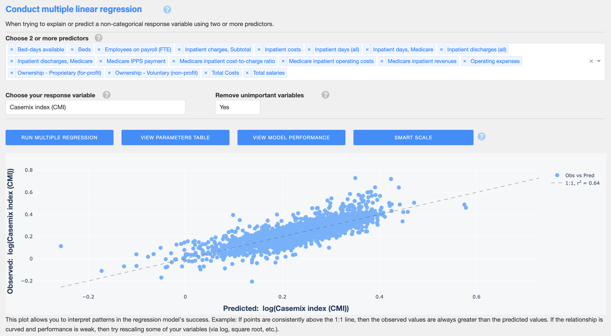

# Rush Regression Workbench
Python source code for a plotly / dash app used for conducting various forms of regression.

## Description and functionality
The [Rush Regression Workbench](https://regression-workbench.herokuapp.com/) is a freely available and lightweight dashboard application for conducting various regression analyses. This open-source tool automates iterative linear and polynomial regressions, multivariable forms of linear and logistic regression, linear and polynomial forms of quantile regression, as well as tests of regression assumptions, automated data encoding, optimized data transformations, machine learning based feature elimination, outlier detection, and construction of residuals plots, confidence intervals, prediction intervals, and diagnostic curves. The regression workbench attempts to recognize invalid data features, helps prevent invalid analyses, and offers tool tips and analytical interpretations.

### Upload Data


### Conduct iterative pairwise regressions


### Conduct a single regression for deeper insights


### Conduct linear and polynomial quantile regression


### Conduct multivariable linear regression


### Conduct multivariable logistic regression


### More to come!

## How to run this app

1. After downloading or cloning this repository, open a terminal window or command prompt in the root folder.

2. Create a virtual environment for running this app with Python (>=3.8)

	In MacOS or Linux:
	  
	```
	python3 -m virtualenv venv
	
	```
	In Unix:
	
	```
	source venv/bin/activate
	
	```
	In Windows: 
	
	```
	venv\Scripts\activate
	```
3. Install required packages using pip:

	```
	pip install -r requirements.txt
	```

4. Run this app locally with:

	```
	python3.8 app.py
	```

	The output of the terminal window will look like:

	```
	Dash is running on http://0.0.0.0:8050/
	```
	
5. Paste the url into your web browser and voila!

## Requirements
These are automatically installed when following the instructions above.

* python version 3.8 or newer
* dash==2.0.0
* gunicorn==20.1.0
* numpy==1.22.1
* pandas==1.4.0
* scipy==1.7.3
* flask==2.0.2
* plotly==5.5.0
* datetime==4.3
* statsmodels==0.13.1
* scikit-learn==1.0.2
* dash\_bootstrap_components==1.0.2
* lxml==4.8.0
* werkzeug==2.0.2

## Files & Directories

<details><summary>app.py</summary>	
The primary file for running the Rush Regression Workbench application. This file contains the entirety of source code for the app as well as many comments to explain the application's functionality.
</details>

<details><summary>assets</summary>
Files in this directory are used by the application to format its interface. All files except `RUSH_full_color.jpg` were obtained from another open source Plotly Dash app (https://github.com/plotly/dash-sample-apps/tree/main/apps/dash-clinical-analytics/assets.): `Acumin-BdPro.otf`, `base.css`, `clinical-analytics.css`, - `plotly_logo.png`- `resizing.js`


- `Acumin-BdPro.otf`: An OpenType font file used by the application. 
- `base.css` A cascading style sheets (CSS) used by the application. CSS is a stylesheet language used to describe the presentation of a document written in HTML or XML.
- `clinical-analytics.css` An additional css file.
- `plotly_logo.png`
- `RUSH_full_color.jpg`
</details>

<details><summary>Procfile</summary>	
This extensionless file is necessary for deployment on Heroku, and essentially tells Heroku how to handle web processes using the gunicorn server. The file contains a single line with the following: `web: gunicorn app:server`
</details>

<details><summary>requirements.txt</summary>
This file lists all of the software libraries needed for the app to run. When deploying the app on Heroku, this file is used to set up the server with the libraries necessary for running the application. When used locally, this file tells pip which libraries need to be installed (i.e., `pip install -r requirements.txt`).
</details>

<details><summary>runtime.txt</summary>
This file is used when setting up the app to run on an online Heroku server. It contains a single line: `python-3.8.16, indicating the version of python to use. 
</details>

## Contributers
* **Developer:** Kenneth J. Locey, PhD. Senior Clinical Data Scientist. Center for Quality, Safety & Value Analytics. Rush University Medical Center.

* **Tester:** Brittnie Dotson, MS. Clinical Data Scientist. Center for Quality, Safety & Value Analytics. Rush University Medical Center.

* **Tester:** Ryan Schipfer, MA. Senior Clinical Data Scientist. Center for Quality, Safety & Value Analytics. Rush University Medical Center.
